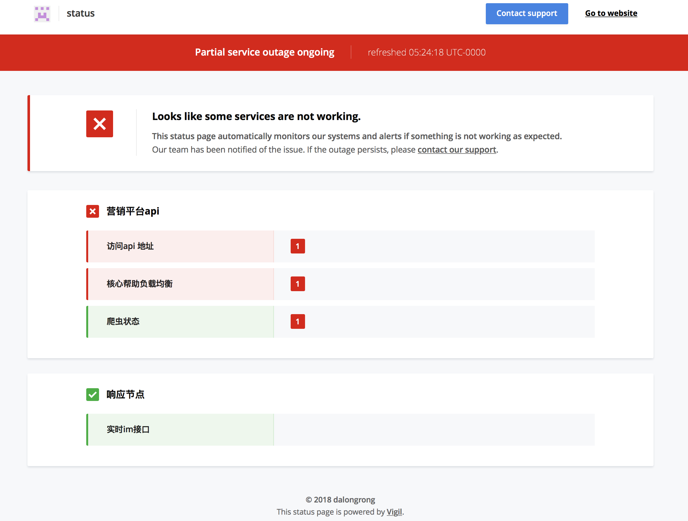

# vigil for microservice monitor

this demo is build with docker you can easily build && and it 
&& see the result

## how to build

```bash
docker build -t myalert .
```

## how to run

```bash
docker run -d -p 8080:8080 myalert
```

## result just like below

